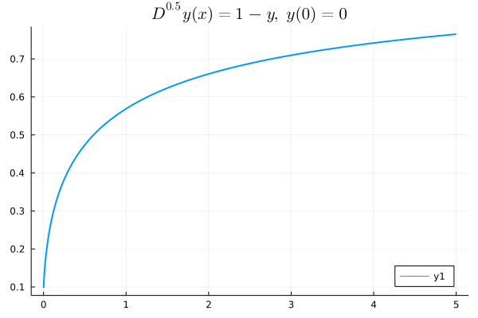
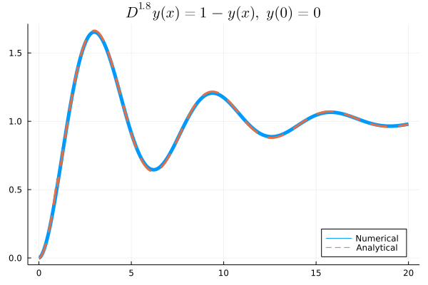

# FDE Example

## An easy example

Long story short! Let's try FractionalDiffEq.jl to solve a fractional differential equation!!!

Suppose we have the initial value problem:

```math
D^{0.5} y(x)=1-y \\
\\
y(0)=0
```
So to solve the problem, we can use FractionalDiffEq.jl like this:

```julia
using FractionalDiffEq, Plots, LaTeXStrings

s="\$D^{0.5}y(x)=1-y,\\ y(0)=0\$"

fun(x, y) = 1-y
prob=FDEProblem(fun, 0.5, 0, 5, 0.001)
result=solve(prob)
tspan=collect(0:0.001:5)

plot(tspan, result, title=s, linewidth=2, legend=:bottomright)
```

And execute the file in your favorite IDE (VSCode recommend).

Bingo!! You get the result!



## Comparison  with analytical solution

Let's see if the result computed using FractionalDiffEq.jl is correct compared with analytical solution.

Suppose there is an initial value problem:

```math
D^{1.8}y(x)+y(x)=1 \\
y(0)=0,\ y'(0)=0
```

We already know the solution of this fractional differential equation is

```math
y(x)=x^{1.8}E_{1.8,\ 2.8}(-x^{1.8})
```

Here, $E$ represent [Mittag Leffler function](https://en.wikipedia.org/wiki/Mittag-Leffler_function):

```math
E_{\alpha,\ \beta}=\displaystyle\sum_{k=0}^{\infty}\frac{z^k}{\Gamma(\alpha k+\beta)}
```

And we use [jlapeyre/MittagLeffler.jl](https://github.com/jlapeyre/MittagLeffler.jl) to generate Mittag Leffler function.

```julia
using FractionalDiffEq
using Plots
using MittagLeffler

#Analytical solution
target = []

for i in 0:0.01:20
    push!(target, i^1.8*mittleff(1.8,2.8,-i^1.8))
end

s="\$D^{0.5}y(x)=1-y,\\ y(0)=0\$"

#Numerical solution
fun(x, y) = 1-y
prob = FDEProblem(fun, 1.8, 0, 20, 0.01)
result=solve(prob)
tspan=collect(0:0.01:20)

gr()

plot(tspan, result, title=s, linewidth=5, label="Numerical", legend=:bottomright)
plot!(tspan, target, lw=3, ls=:dash, label="Analytical")
```

And execute the program you can get:



